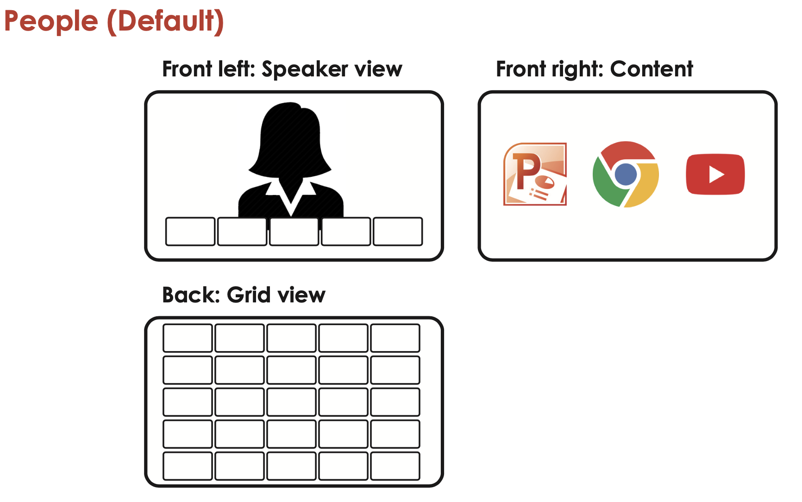

# Webex Codec Pro Layout Change Macros

Webex Macro that changes display layout according to the Panel button selected while in a call

## Contacts
* Gerardo Chaves (gchaves@cisco.com)

## Solution Components
* Webex Codec Pro
* Webex Macros
* Javascript

## Installation

IMPORTANT: This macro assumes that on the CodecPro the "Front Left" display is connected to Video output 1, 
the "Back" display is connected to Video output 2 and the "Front right" display is connected to Video output 3. 

1. In Codec Pro admin dashboard, go to "Macro Editor".

2. Create a new Macro.

3. Copy macros.js into the new Macro's text area.

4. Save and enable the Macro. As the Macro subscribes to the call connected and presentation started events, the desired behavior will be persistent as long as the Macro is enabled.

5. Back in the Codec Pro admin dashboard, select the  UI Extensions menu from the Customization section on the left. Then using the "hamburger menu" 
   on the upper right select "Merge from file" and select the `roomcontrolconfig.xml` from this repository. This should load the 3 panel buttons that will become 
   active when in a call and will allow you to trigger the macro functionality when pressed to select a layout
   

## Usage

Once the panel buttons are properly intalled and the macro is activated, connect to a call on the Codec Pro devices and press on the corresponding Panel button to obtain the 
following layouts:

### People (Default)

### Content

### Meeting

## License
Provided under Cisco Sample Code License, for details see [LICENSE](./LICENSE)

## Code of Conduct
Our code of conduct is available [here](./CODE_OF_CONDUCT.md)

## Contributing
See our contributing guidelines [here](./CONTRIBUTING.md)
